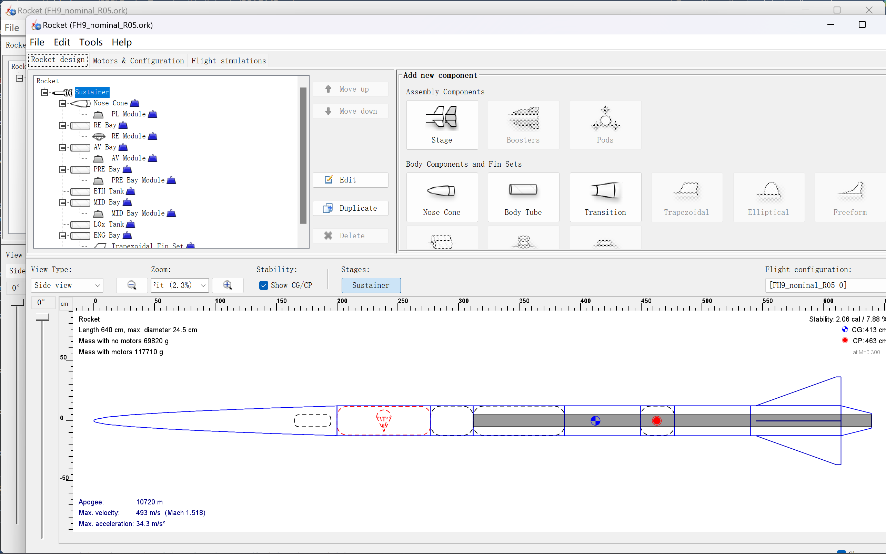

# orcli
For a documentation on how to setup/use/troubleshoot or how this works from a general perspective, see https://rocket-team.epfl.ch/en/competition/firehorn/flight-dynamics/orcli

The goal of this was to facilitate using OpenRocket (OR) through a command line interface.
As of now, this is what ORCLI does:
- Take 5 arguments from user: `<component>`, `<property>`, `<start>`, `<end>`, `<iterations>`.
An example would be: ./a nosecone length 1 2 6
- Uniformly divide the interval [`<start>`;`<end>`] into `<iterations>` values.
With the same example: [1;2] would be divided into the 6 values: 1, 1.2, 1.4, 1.6, 1.8, 2.
- For a given rocket, run `<iterations>` simulations, each with `<component>`'s `<property>` set to a different value obtained from the previous division.
With the same example: 6 simulations would be run, with nosecone's length set to respectively: 1, 1.2, 1.4, 1.6, 1.8, 2.
- Data from each simulation is saved to a separate Excel sheet of an Excel workbook.

Here, detailed documentation on what the `.ahk` scripts do will be given.
For documentation on AHK itself, see https://www.autohotkey.com/docs/v2/.

# open.ahk
This script opens a `.ork`, whose path is passed to it as an argument, in OR.
This script takes 1 argument: the (absolute) path to the `.ork` file to be opened. When `open.ahk` is called in `orcli.cpp`, it is called with the argument `FILEPATH`, which must be modified directly in the code before compilation.
In AHK, the first argument can be accessed via `A_Args[1]`, the second by `A_Args[2]`, etc.

In addition, a variable `ORPATH` is initialized with a string containing the path to `OpenRocket.exe`. This will be used later to run OR, in case it is not already open. This path must be modified manually.

First, the script checks whether OR is open. This is because opening OR takes more time to just activating it (switching to an OR window). It then splits into 2 cases.
### OR is open

*OR is open*
If OR is open, it will:
- render OR the active window

*OR is active*
- initialize a variable `winid` with the window ID of the active OR window (each window has an unique ID, which AHK uses to manipulate them; for more information, see https://www.autohotkey.com/docs/v2/howto/ManageWindows.htm)
- send `[ctrl]` + `o` to OR, the OR shortcut for "open file"

*some OR file-related shortcuts*
- wait until the "open file" dialog is open

*"open file" dialog*
- in the `file name` box, enter `A_Arg[1]`, which is the first argument passed to this program, and which should contain the path to the `.ork` file to be opened

*"open file" dialog with file path entered in `file name` box*
- send `[enter]` to the dialog, confirming the file opening

OR, upon opening a file, creates a new window. The particularity is that, if initially no file was open, it kills the old window after opening the new window automatically.

*no file is opened*

However, if a file was already open, it leaves that window open, and creates a new window on top of that one.

*new window on top of old window*

Hence, to prevent windows piling up, we have kill that window manually - if it exists. The next part of the script does that.

- wait until the old window is inactive (active window either becomes that of the new file, or a loading dialog if the file opening takes too long)
- check if a loading dialog is active
  - if yes, wait until it is no longer active (until it finishes)
- wait until the old window is inactive (wait until the new file window is created)
- check if the old window still exists (if it has not been automatically killed)
  - if yes, kill it

### OR is not open

*OR is not open*
If OR is not open, it will:
- run `OpenRocket.exe` through the path stored in `ORPATH`, passing 1 argument to it: `A_Args[1]`, the first argument passed to the script, which stores the path of the `.ork` file to be opened

This opens the file automatically as soo as OR is open.

- wait until OR is open, i.e., until this window shows up:

*OR window with opened file*

### End
Exit the script when everything is done.

**Note**: each `.ahk` script has been coded with an exit button bound to `[esc]`. Pressing `[esc]` will force exit the script at any time.

# run.ahk
This script runs the topmost simulation in OR. If there is no existing simulation, it will not work properly.
This script takes no arguments.

A variable `runButton` is initialized to the position (client) of the button `Flight simulations` in OR. This position must be mnodified manually, as it may depend on the GUI scaling of OR on your device, amongst other factors. For a guide on how to obtain that position, see https://rocket-team.epfl.ch/en/competition/firehorn/flight-dynamics/orcli#setup.

First, the script checks whether OR is open. If not, which should not happen, it creates an error message box, then exits.
If yes, it will:
- render OR the active window

*OR is active*
- set the mouse position to runButton and press left click once (select the `Flight simulations` tab)

*OR's `Flight simulations` tab*
- wait for 100ms, which is the wait time which makes this script run most consistently on my device. This time should be adjusted to suit your device.
- set the mouse position to runButton and press left click once (select the `Flight simulations` tab again, highlighting it)

*`Flight simulations` button highlighted*

The previous step makes it so that the selected element is the `Flight simulations` button, and not the topmost simulation, which is the default. Hence, when you press `[tab]`, the selection will move between the different buttons:

*buttons*

Instead of the different simulations:

*simulations*

- enter a loop which sends `[tab]` 3 times to OR, with a 20ms wait between each send. 20ms is the wait time makes this sequence the most consistent on my device. This time should be adjusted to suit your device. This step should move the selection to the `Run simulations` button.
- send `[enter]` to OR, running the selected simulation (by default, the topmost one)
- wait until the "running simulations" dialog exists

- wait until the "running simulations" dialog is no longer active (until it finishes)
- exit the script

**Note**: each `.ahk` script has been coded with an exit button bound to `[esc]`. Pressing `[esc]` will force exit the script at any time.

# save.ahk
This script saves the open file in OR.
This script takes no argument.

First, the script checks whether OR is the active window. If not, which should not happen, it will directly exit.
If yes, it will:
- send `[ctrl]` + `s` to OR, the OR shortcut for "save file"

*some OR file-related shortcuts*

Next, a "save options" dialog **may or may not** appear. If it does, it will ask if all simulation data should be saved, or only summary data should be saved. The default is all data, which is what we want, so if it appears, we directly press `[enter]` to close it.

*"save options" dialog*

- wait for 200ms, which is the time it takes on my device for the "save options" dialog to appear. This time should be adjusted to suit your device.
- check if the dialog appeared
  - if yes, send `[enter]` to the dialog
 
If the file takes too long to save, a loading dialog will appear.

- wait for 1s, which is the time it takes on my device for the file to finish saving / for the loading dialog to appear. This time should be adjusted to suit your device.
- check if the loading dialog exists
  - if yes, wait until it becomes inactive (until it finishes)
- exit the script

**Note**: each `.ahk` script has been coded with an exit button bound to `[esc]`. Pressing `[esc]` will force exit the script at any time.

(in progress)
